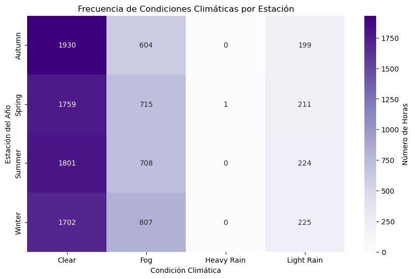

# Machine Leraning Final Project -  Bike Sharing Demand Analysis
This project explores the *Bike Sharing Demand* dataset to understand factors that influence bike rental demand in Washington D.C.
The bike sharing systems allow to people rent a bike from a one location and return it to a different place on an as-needed basis. 

## Initial Exploratoration - Bike Sharing Demand Dataset
This section performs the initial loading of the dataset and a first general inspection to understand the structure and available attributes.

## Objectives
- Load and explore the dataset  
- Analyze hourly, daily, and seasonal bike usage  
- Investigate the impact of weather and temperature  
- Visualize distributions and detect outliers  
- Evaluate correlations between features  

### Tools and Libraries
- Python  
- Pandas  
- NumPy  
- Seaborn  
- Matplotlib
- Jupyter Notebook
- Github 


```python
# Import libraries
import numpy as np
import pandas as pd
import matplotlib.pyplot as plt
import seaborn as sns

pd.set_option('display.float_format', '{:.2f}'.format)
```

## Dataset
the data provide hourly rental data spanning two years and combine usage patterns with weather data to forescast bike rental demand in Washington D.C.

Dataset used: bike-sharing-demand.csv
Including attributes as:

**datetime:** hourly date + timestamp  
**season:** (1) = spring, (2) = summer, (3) = fall, (4) = winter 
**holiday:** whether the day is considered a holiday
**workingday:** whether the day is neither a weekend nor holiday
**weather:** (1): Clear, Few clouds, Partly cloudy, Partly cloudy
(2): Mist + Cloudy, Mist + Broken clouds, Mist + Few clouds, Mist
(3): Light Snow, Light Rain + Thunderstorm + Scattered clouds, Light Rain + Scattered clouds
(4): Heavy Rain + Ice Pallets + Thunderstorm + Mist, Snow + Fog 
**temp:** real temperature in Celsius
**atemp:** "feels like" temperature in Celsius
**humidity:** relative humidity
**windspeed:** wind speed
**casual:** number of non-registered user rentals initiated
**registered:** number of registered user rentals initiated
**count:** number of total rentals


```python
# Load the dataset
bike_sharing_demand_df = pd.read_csv("intro_to_github_dir/project/Bike_Sharing_Demand/bike-sharing-demand.csv")

```

## First glance at the dataset


```python
# Display the first few rows to confirm loading
bike_sharing_demand_df.head()
```


<div>
<style scoped>
    .dataframe tbody tr th:only-of-type {
        vertical-align: middle;
    }

    .dataframe tbody tr th {
        vertical-align: top;
    }

    .dataframe thead th {
        text-align: right;
    }
</style>
<table border="1" class="dataframe">
  <thead>
    <tr style="text-align: right;">
      <th></th>
      <th>datetime</th>
      <th>season</th>
      <th>holiday</th>
      <th>workingday</th>
      <th>weather</th>
      <th>temp</th>
      <th>atemp</th>
      <th>humidity</th>
      <th>windspeed</th>
      <th>casual</th>
      <th>registered</th>
      <th>count</th>
    </tr>
  </thead>
  <tbody>
    <tr>
      <th>0</th>
      <td>01/01/2011 00:00</td>
      <td>1</td>
      <td>0</td>
      <td>0</td>
      <td>1</td>
      <td>9.84</td>
      <td>14.39</td>
      <td>81</td>
      <td>0.00</td>
      <td>3</td>
      <td>13</td>
      <td>16</td>
    </tr>
    <tr>
      <th>1</th>
      <td>01/01/2011 01:00</td>
      <td>1</td>
      <td>0</td>
      <td>0</td>
      <td>1</td>
      <td>9.02</td>
      <td>13.63</td>
      <td>80</td>
      <td>0.00</td>
      <td>8</td>
      <td>32</td>
      <td>40</td>
    </tr>
    <tr>
      <th>2</th>
      <td>01/01/2011 02:00</td>
      <td>1</td>
      <td>0</td>
      <td>0</td>
      <td>1</td>
      <td>9.02</td>
      <td>13.63</td>
      <td>80</td>
      <td>0.00</td>
      <td>5</td>
      <td>27</td>
      <td>32</td>
    </tr>
    <tr>
      <th>3</th>
      <td>01/01/2011 03:00</td>
      <td>1</td>
      <td>0</td>
      <td>0</td>
      <td>1</td>
      <td>9.84</td>
      <td>14.39</td>
      <td>75</td>
      <td>0.00</td>
      <td>3</td>
      <td>10</td>
      <td>13</td>
    </tr>
    <tr>
      <th>4</th>
      <td>01/01/2011 04:00</td>
      <td>1</td>
      <td>0</td>
      <td>0</td>
      <td>1</td>
      <td>9.84</td>
      <td>14.39</td>
      <td>75</td>
      <td>0.00</td>
      <td>0</td>
      <td>1</td>
      <td>1</td>
    </tr>
  </tbody>
</table>
</div>


## Gneral structure of data: 
Columns, datatype and null vals. Broader picture of the dataset.
- The dataframe has 10886 data point (registers), with 12 columns which are attributes. 11 atributes to describe weather and and bike usage patterns.
- Dtype: there is not null values in any column. int64: integers, float64: decimal numb and object(datetime): text or dates as a string
- memory usage in the comp, aprox 1 megabyte
- int64 works like a categorical data because describe numerical codification labels


```python
bike_sharing_demand_df.info()
```

    <class 'pandas.core.frame.DataFrame'>
    RangeIndex: 10886 entries, 0 to 10885
    Data columns (total 12 columns):
     #   Column      Non-Null Count  Dtype  
    ---  ------      --------------  -----  
     0   datetime    10886 non-null  object 
     1   season      10886 non-null  int64  
     2   holiday     10886 non-null  int64  
     3   workingday  10886 non-null  int64  
     4   weather     10886 non-null  int64  
     5   temp        10886 non-null  float64
     6   atemp       10886 non-null  float64
     7   humidity    10886 non-null  int64  
     8   windspeed   10886 non-null  float64
     9   casual      10886 non-null  int64  
     10  registered  10886 non-null  int64  
     11  count       10886 non-null  int64  
    dtypes: float64(3), int64(8), object(1)
    memory usage: 1020.7+ KB
    

## Columns of the data set
To know attributes and verify column names


```python
bike_sharing_demand_df.columns
```


    Index(['datetime', 'season', 'holiday', 'workingday', 'weather', 'temp',
           'atemp', 'humidity', 'windspeed', 'casual', 'registered', 'count'],
          dtype='object')


# Statistical summary 


```python
bike_sharing_demand_df.describe
```


    <bound method NDFrame.describe of                datetime  season  holiday  workingday  weather  temp  atemp  \
    0      01/01/2011 00:00       1        0           0        1  9.84  14.39   
    1      01/01/2011 01:00       1        0           0        1  9.02  13.63   
    2      01/01/2011 02:00       1        0           0        1  9.02  13.63   
    3      01/01/2011 03:00       1        0           0        1  9.84  14.39   
    4      01/01/2011 04:00       1        0           0        1  9.84  14.39   
    ...                 ...     ...      ...         ...      ...   ...    ...   
    10881  19/12/2012 19:00       4        0           1        1 15.58  19.70   
    10882  19/12/2012 20:00       4        0           1        1 14.76  17.43   
    10883  19/12/2012 21:00       4        0           1        1 13.94  15.91   
    10884  19/12/2012 22:00       4        0           1        1 13.94  17.43   
    10885  19/12/2012 23:00       4        0           1        1 13.12  16.66   
    
           humidity  windspeed  casual  registered  count  
    0            81       0.00       3          13     16  
    1            80       0.00       8          32     40  
    2            80       0.00       5          27     32  
    3            75       0.00       3          10     13  
    4            75       0.00       0           1      1  
    ...         ...        ...     ...         ...    ...  
    10881        50      26.00       7         329    336  
    10882        57      15.00      10         231    241  
    10883        61      15.00       4         164    168  
    10884        61       6.00      12         117    129  
    10885        66       9.00       4          84     88  
    
    [10886 rows x 12 columns]>


# Unique category of each attribute.


```python
print("season:", bike_sharing_demand_df['season'].unique())
print("holiday:", bike_sharing_demand_df['holiday'].unique())
print("workingday:", bike_sharing_demand_df['workingday'].unique())
print("weather:", bike_sharing_demand_df['weather'].unique())
```

    season: [1 2 3 4]
    holiday: [0 1]
    workingday: [0 1]
    weather: [1 2 3 4]
    

# Data cleaning:
## (1) Finding null values per column
Since the result is an empty DataFrame, that confirms there are no rows with any missing values.


```python
bike_sharing_demand_df.isnull().sum()
```


    datetime      0
    season        0
    holiday       0
    workingday    0
    weather       0
    temp          0
    atemp         0
    humidity      0
    windspeed     0
    casual        0
    registered    0
    count         0
    dtype: int64


```python
null_val = bike_sharing_demand_df[bike_sharing_demand_df.isna().any(axis=1)]
print(null_val)
```

    Empty DataFrame
    Columns: [datetime, season, holiday, workingday, weather, temp, atemp, humidity, windspeed, casual, registered, count]
    Index: []
    

# Data cleaning (continuation)
## (2)Duplicates


```python
duplicados =  bike_sharing_demand_df.duplicated().sum()
print(f"Duduplicados encontrados: {duplicados}")
```

    Duduplicados encontrados: 0
    

# Converting Datetime to numeric column, and creating new columns
As we need information about the rental hours of the bicycles, we need to extract this information from the datetime column, which is of type object.


```python
bike_sharing_demand_df['datetime'] = pd.to_datetime(bike_sharing_demand_df['datetime'], dayfirst=True)

print(bike_sharing_demand_df["datetime"].dtype)
```

    datetime64[ns]
    


```python
#Convert Datetime to numeric column
bike_sharing_demand_df['datetime'] = pd.to_datetime(bike_sharing_demand_df['datetime'])

# Temporal analysis
bike_sharing_demand_df['hour'] = bike_sharing_demand_df['datetime'].dt.hour        # 0-23 (int)
bike_sharing_demand_df['day'] = bike_sharing_demand_df['datetime'].dt.day          # 1-31 (int)
bike_sharing_demand_df['month'] = bike_sharing_demand_df['datetime'].dt.month      # 1-12 (int)
bike_sharing_demand_df['year'] = bike_sharing_demand_df['datetime'].dt.year        # 2011, 2012 (int)
bike_sharing_demand_df['weekday'] = bike_sharing_demand_df['datetime'].dt.dayofweek # 0-6 (int, 0=Mon)

# Dtypes
print(bike_sharing_demand_df[['hour', 'day', 'month', 'year', 'weekday']].dtypes)
```

    hour       int32
    day        int32
    month      int32
    year       int32
    weekday    int32
    dtype: object
    


```python
# Null values in datetime
print(bike_sharing_demand_df["datetime"].isnull().sum())
print(bike_sharing_demand_df["datetime"].unique()[10])
```

    0
    2011-01-01 10:00:00
    


```python
bike_sharing_demand_df['datetime'] = pd.to_datetime(bike_sharing_demand_df['datetime'], errors='coerce')
# This converts problematic values to NaT (Not a Time).
```

## How looks the dataset with the new numeric columns


```python
bike_sharing_demand_df.head()
```


<div>
<style scoped>
    .dataframe tbody tr th:only-of-type {
        vertical-align: middle;
    }

    .dataframe tbody tr th {
        vertical-align: top;
    }

    .dataframe thead th {
        text-align: right;
    }
</style>
<table border="1" class="dataframe">
  <thead>
    <tr style="text-align: right;">
      <th></th>
      <th>datetime</th>
      <th>season</th>
      <th>holiday</th>
      <th>workingday</th>
      <th>weather</th>
      <th>temp</th>
      <th>atemp</th>
      <th>humidity</th>
      <th>windspeed</th>
      <th>casual</th>
      <th>registered</th>
      <th>count</th>
      <th>hour</th>
      <th>day</th>
      <th>month</th>
      <th>year</th>
      <th>weekday</th>
    </tr>
  </thead>
  <tbody>
    <tr>
      <th>0</th>
      <td>2011-01-01 00:00:00</td>
      <td>1</td>
      <td>0</td>
      <td>0</td>
      <td>1</td>
      <td>9.84</td>
      <td>14.39</td>
      <td>81</td>
      <td>0.00</td>
      <td>3</td>
      <td>13</td>
      <td>16</td>
      <td>0</td>
      <td>1</td>
      <td>1</td>
      <td>2011</td>
      <td>5</td>
    </tr>
    <tr>
      <th>1</th>
      <td>2011-01-01 01:00:00</td>
      <td>1</td>
      <td>0</td>
      <td>0</td>
      <td>1</td>
      <td>9.02</td>
      <td>13.63</td>
      <td>80</td>
      <td>0.00</td>
      <td>8</td>
      <td>32</td>
      <td>40</td>
      <td>1</td>
      <td>1</td>
      <td>1</td>
      <td>2011</td>
      <td>5</td>
    </tr>
    <tr>
      <th>2</th>
      <td>2011-01-01 02:00:00</td>
      <td>1</td>
      <td>0</td>
      <td>0</td>
      <td>1</td>
      <td>9.02</td>
      <td>13.63</td>
      <td>80</td>
      <td>0.00</td>
      <td>5</td>
      <td>27</td>
      <td>32</td>
      <td>2</td>
      <td>1</td>
      <td>1</td>
      <td>2011</td>
      <td>5</td>
    </tr>
    <tr>
      <th>3</th>
      <td>2011-01-01 03:00:00</td>
      <td>1</td>
      <td>0</td>
      <td>0</td>
      <td>1</td>
      <td>9.84</td>
      <td>14.39</td>
      <td>75</td>
      <td>0.00</td>
      <td>3</td>
      <td>10</td>
      <td>13</td>
      <td>3</td>
      <td>1</td>
      <td>1</td>
      <td>2011</td>
      <td>5</td>
    </tr>
    <tr>
      <th>4</th>
      <td>2011-01-01 04:00:00</td>
      <td>1</td>
      <td>0</td>
      <td>0</td>
      <td>1</td>
      <td>9.84</td>
      <td>14.39</td>
      <td>75</td>
      <td>0.00</td>
      <td>0</td>
      <td>1</td>
      <td>1</td>
      <td>4</td>
      <td>1</td>
      <td>1</td>
      <td>2011</td>
      <td>5</td>
    </tr>
  </tbody>
</table>
</div>


```python
print(bike_sharing_demand_df.info())
print(bike_sharing_demand_df.describe())
```

    <class 'pandas.core.frame.DataFrame'>
    RangeIndex: 10886 entries, 0 to 10885
    Data columns (total 17 columns):
     #   Column      Non-Null Count  Dtype         
    ---  ------      --------------  -----         
     0   datetime    10886 non-null  datetime64[ns]
     1   season      10886 non-null  int64         
     2   holiday     10886 non-null  int64         
     3   workingday  10886 non-null  int64         
     4   weather     10886 non-null  int64         
     5   temp        10886 non-null  float64       
     6   atemp       10886 non-null  float64       
     7   humidity    10886 non-null  int64         
     8   windspeed   10886 non-null  float64       
     9   casual      10886 non-null  int64         
     10  registered  10886 non-null  int64         
     11  count       10886 non-null  int64         
     12  hour        10886 non-null  int32         
     13  day         10886 non-null  int32         
     14  month       10886 non-null  int32         
     15  year        10886 non-null  int32         
     16  weekday     10886 non-null  int32         
    dtypes: datetime64[ns](1), float64(3), int32(5), int64(8)
    memory usage: 1.2 MB
    None
                                datetime   season  holiday  workingday  weather  \
    count                          10886 10886.00 10886.00    10886.00 10886.00   
    mean   2011-12-27 05:56:22.399411968     2.51     0.03        0.68     1.42   
    min              2011-01-01 00:00:00     1.00     0.00        0.00     1.00   
    25%              2011-07-02 07:15:00     2.00     0.00        0.00     1.00   
    50%              2012-01-01 20:30:00     3.00     0.00        1.00     1.00   
    75%              2012-07-01 12:45:00     4.00     0.00        1.00     2.00   
    max              2012-12-19 23:00:00     4.00     1.00        1.00     4.00   
    std                              NaN     1.12     0.17        0.47     0.63   
    
              temp    atemp  humidity  windspeed   casual  registered    count  \
    count 10886.00 10886.00  10886.00   10886.00 10886.00    10886.00 10886.00   
    mean     20.23    23.66     61.89      12.80    36.02      155.55   191.57   
    min       0.82     0.76      0.00       0.00     0.00        0.00     1.00   
    25%      13.94    16.66     47.00       7.00     4.00       36.00    42.00   
    50%      20.50    24.24     62.00      13.00    17.00      118.00   145.00   
    75%      26.24    31.06     77.00      17.00    49.00      222.00   284.00   
    max      41.00    45.45    100.00      57.00   367.00      886.00   977.00   
    std       7.79     8.47     19.25       8.16    49.96      151.04   181.14   
    
              hour      day    month     year  weekday  
    count 10886.00 10886.00 10886.00 10886.00 10886.00  
    mean     11.54     9.99     6.52  2011.50     3.01  
    min       0.00     1.00     1.00  2011.00     0.00  
    25%       6.00     5.00     4.00  2011.00     1.00  
    50%      12.00    10.00     7.00  2012.00     3.00  
    75%      18.00    15.00    10.00  2012.00     5.00  
    max      23.00    19.00    12.00  2012.00     6.00  
    std       6.92     5.48     3.44     0.50     2.00  
    

## Temporal Statistics
Acording with the time pattern, is observed that the highest demand for bike rentals occurs during working hours, with the peaks between 7-9 and 16-19 h. 
It´s noted that durent the night-time period, demanc is very low.


```python
# Rented bikes (average) per Hour 
hourly_pattern = bike_sharing_demand_df.groupby('hour')['count'].mean()
hourly_pattern.plot(kind='bar', figsize=(12, 6), title='Rented bikes (average) per Hour')
plt.xlabel('Hour of the day')
plt.ylabel('Rented bikes (average)')
plt.xticks(rotation=0)
plt.show()

# in numbers
print("=== TIME PATTERN ===")
print(hourly_pattern.round(2))
```


    

    


    === TIME PATTERN ===
    hour
    0     55.14
    1     33.86
    2     22.90
    3     11.76
    4      6.41
    5     19.77
    6     76.26
    7    213.12
    8    362.77
    9    221.78
    10   175.09
    11   210.67
    12   256.51
    13   257.79
    14   243.44
    15   254.30
    16   316.37
    17   468.77
    18   430.86
    19   315.28
    20   228.52
    21   173.37
    22   133.58
    23    89.51
    Name: count, dtype: float64
    

## Analysis: Rented bikes per Day


```python
# Creating labels for week days
day_labels = ["Mon", "Tue", "Wed", "Thu", "Fri", "Sat", "Sun"]
weekly_pattern = bike_sharing_demand_df.groupby('weekday')['count'].mean()

# Graphic
weekly_pattern.plot(kind='bar', figsize=(10, 6), title='Rented bikes (average) per day of week')
plt.xlabel('Weekday')
plt.ylabel('Rented bikes (average)')
plt.xticks(range(7), day_labels, rotation=0)
plt.show()
```


    

    


Since the analysis per day does not show a clear pattern, an analysis pero hour per day would be clarified the behaviour of the rental system.


```python
# Creating labels for week days
day_labels = ["Mon", "Tue", "Wed", "Thu", "Fri", "Sat", "Sun"]
weekly_pattern = bike_sharing_demand_df.groupby('weekday')['count'].mean()

# Creating time pattern per day of the week 
hourly_weekly_pattern = bike_sharing_demand_df.groupby(['hour', 'weekday'])['count'].mean().reset_index()

# Labels 
day_name = {0: 'Mon', 1: 'Tue', 2: 'Wed', 3: 'Thu', 
             4: 'Fri', 5: 'Sat', 6: 'Sun'}
hourly_weekly_pattern['day_name'] = hourly_weekly_pattern['weekday'].map(day_name)

# Style of the graphic
plt.style.use('seaborn-v0_8')
fig, ax = plt.subplots(figsize=(14, 8))

# Colours
colors = ['#1f77b4', '#ff7f0e', '#2ca02c', '#d62728', '#9467bd', '#17becf', '#e377c2']
weekend_colors = ['#17becf', '#e377c2']  

# lines graphic
for i, day in enumerate(range(7)):
    day_data = hourly_weekly_pattern[hourly_weekly_pattern['weekday'] == day]
    
# for weekend
    linewidth = 3 if day >= 5 else 2
    linestyle = '-' if day < 5 else '--'  
    
    plt.plot(day_data['hour'], day_data['count'], 
             marker='o', markersize=4, linewidth=linewidth, linestyle=linestyle,
             label=day_name[day], color=colors[i], alpha=0.8)

plt.xlabel('Hour', fontsize=14, fontweight='bold')
plt.ylabel('Rented Bikes (average)', fontsize=14, fontweight='bold')
plt.title('Rented Bikes Demand per hour and day', 
          fontsize=16, fontweight='bold', pad=20)
plt.xlim(-0.5, 23.5)
plt.xticks(range(0, 24, 2))
plt.grid(True, alpha=0.3)
legend = plt.legend(bbox_to_anchor=(1.05, 1), loc='upper left', 
                   frameon=True, fancybox=True, shadow=True)
legend.get_frame().set_facecolor('white')
legend.get_frame().set_alpha(0.9)
plt.tight_layout()
plt.show()

# Análisis estadístico adicional
print("=== Analysis per day ===")
print("\n1. Average per Day:")
daily_averages = bike_sharing_demand_df.groupby('weekday')['count'].mean()
for day, avg in daily_averages.items():
    print(f"   {day_name[day]}: {avg:.1f} bicicletas/hora")

print("\n2. Peak hours per Day:")
for day in range(7):
    day_data = hourly_weekly_pattern[hourly_weekly_pattern['weekday'] == day]
    peak_hour = day_data.loc[day_data['count'].idxmax(), 'hour']
    peak_demand = day_data['count'].max()
    print(f"   {day_name[day]}: Hora {peak_hour}:00 ({peak_demand:.1f} bicicletas)")

print("\n3. Hour with less demand per day:")
for day in range(7):
    day_data = hourly_weekly_pattern[hourly_weekly_pattern['weekday'] == day]
    low_hour = day_data.loc[day_data['count'].idxmin(), 'hour']
    low_demand = day_data['count'].min()
    print(f"   {day_name[day]}: Hour {low_hour}:00 ({low_demand:.1f} bikes)")


# Gráfico adicional: Heatmap de demanda
print("\n=== HEATMAP DEMAND ===")
fig, ax = plt.subplots(figsize=(12, 6))

# Matrix
heatmap_data = hourly_weekly_pattern.pivot(index='day_name', columns='hour', values='count')
day_order = ['Mon', 'Tue', 'Wed', 'Thu', 'Fri', 'Sat', 'Sun']
heatmap_data = heatmap_data.reindex(day_order)

# heatmap
sns.heatmap(heatmap_data, annot=False, cmap='YlOrRd', fmt='.0f', 
            cbar_kws={'label': 'Rented Bikes (average)'})

plt.title('Heatmap: Rented Bikes Demand per hour and day', fontsize=14, fontweight='bold')
plt.xlabel('Hour', fontsize=14)
plt.ylabel('Day', fontsize=14)
plt.tight_layout()
plt.show()
```


    

    


    === Analysis per day ===
    
    1. Average per Day:
       Mon: 190.4 bicicletas/hora
       Tue: 189.7 bicicletas/hora
       Wed: 188.4 bicicletas/hora
       Thu: 197.3 bicicletas/hora
       Fri: 197.8 bicicletas/hora
       Sat: 196.7 bicicletas/hora
       Sun: 180.8 bicicletas/hora
    
    2. Peak hours per Day:
       Mon: Hora 17:00 (521.4 bicicletas)
       Tue: Hora 17:00 (544.2 bicicletas)
       Wed: Hora 17:00 (509.3 bicicletas)
       Thu: Hora 17:00 (536.6 bicicletas)
       Fri: Hora 17:00 (502.0 bicicletas)
       Sat: Hora 13:00 (402.9 bicicletas)
       Sun: Hora 13:00 (384.8 bicicletas)
    
    3. Hour with less demand per day:
       Mon: Hour 3:00 (5.7 bikes)
       Tue: Hour 3:00 (4.0 bikes)
       Wed: Hour 4:00 (4.6 bikes)
       Thu: Hour 3:00 (4.9 bikes)
       Fri: Hour 4:00 (5.9 bikes)
       Sat: Hour 4:00 (7.7 bikes)
       Sun: Hour 5:00 (9.5 bikes)
    
    === HEATMAP DEMAND ===
    


    

    


```python
# by month
monthly_pattern = bike_sharing_demand_df.groupby('month')['count'].mean()
monthly_pattern.plot(kind='line', marker='o', figsize=(12, 6), title='Rented bikes (average) per month')
plt.xlabel('Month')
plt.ylabel('Rented bikes (average)')
plt.xticks(range(1, 13))
plt.grid(True)
plt.show()
```


    

    


## Correlation Matrix
correlation between all the attributes. 


```python
#Only numeric columns
numeric_cols = ['count', 'casual', 'registered', 'temp', 'atemp', 'humidity', 
                'windspeed', 'hour', 'day', 'month', 'year', 'weekday', 'weather']

#Correlation matrix
corr_matrix = bike_sharing_demand_df[numeric_cols].corr()

# show correlations with "count" sorted to see which have more weight correlation
print("=== Correlation - Total Demand (count) ===")
count_correlations = corr_matrix['count'].abs().sort_values(ascending=False)
print(count_correlations)
```

    === Correlation - Total Demand (count) ===
    count        1.00
    registered   0.97
    casual       0.69
    hour         0.40
    temp         0.39
    atemp        0.39
    humidity     0.32
    year         0.26
    month        0.17
    weather      0.13
    windspeed    0.10
    day          0.02
    weekday      0.00
    Name: count, dtype: float64
    


```python
#Correlation Matrix - Heatmap
#correlation between all the attributes. 

#Only numeric columns
numeric_cols = ['count', 'casual', 'registered', 'temp', 'atemp', 'humidity', 
                'windspeed', 'hour', 'day', 'month', 'year', 'weekday', 'weather']

#Correlation matrix
corr_matrix = bike_sharing_demand_df[numeric_cols].corr()

#display the matrix as a heatmap
plt.figure(figsize=(10, 8))
sns.heatmap(corr_matrix, annot=True, cmap="coolwarm", center=0, square=True, fmt=".2f")
plt.title("Correlation Matrix - Bike sharing Demand")
plt.show()
```


    

    


```python
print("\n=== TOP CORRELATIONS DEMAND ===")
print(f"Temperatura: {bike_sharing_demand_df['count'].corr(bike_sharing_demand_df['temp']):.3f}")
print(f"Temperatura aparente: {bike_sharing_demand_df['count'].corr(bike_sharing_demand_df['atemp']):.3f}")
print(f"Humedad: {bike_sharing_demand_df['count'].corr(bike_sharing_demand_df['humidity']):.3f}")
print(f"Velocidad viento: {bike_sharing_demand_df['count'].corr(bike_sharing_demand_df['windspeed']):.3f}")
print(f"Hora del día: {bike_sharing_demand_df['count'].corr(bike_sharing_demand_df['hour']):.3f}")
print(f"Mes del año: {bike_sharing_demand_df['count'].corr(bike_sharing_demand_df['month']):.3f}")
print(f"Condición climática: {bike_sharing_demand_df['count'].corr(bike_sharing_demand_df['weather']):.3f}")
```

    
    === TOP CORRELATIONS DEMAND ===
    Temperatura: 0.394
    Temperatura aparente: 0.390
    Humedad: -0.317
    Velocidad viento: 0.101
    Hora del día: 0.401
    Mes del año: 0.167
    Condición climática: -0.129
    

## Statistic Analysis by Season


```python
# Converting in Categorical

# keep original df (numeric for corr)
# season (1,2,3,4) y weather (1,2,3,4) continue exist

# new columns - Season
season_mapping = {
    1: 'Spring', 2: 'Summer', 3: 'Autumn', 4: 'Winter'
}
weather_mapping = {
    1: 'Clear', 2: 'Fog', 3: 'Light Rain', 4: 'Heavy Rain'
}

bike_sharing_demand_df['season_label'] = bike_sharing_demand_df['season'].map(season_mapping)
bike_sharing_demand_df['weather_label'] = bike_sharing_demand_df['weather'].map(weather_mapping)

# confirmation of the both df dtype
print("Numeric attributes (for corralations):")
print(f"season: {bike_sharing_demand_df['season'].dtype}")        # int64
print(f"weather: {bike_sharing_demand_df['weather'].dtype}")      # int64

print("\nCategoric (for interpretation):")  
print(f"season_label: {bike_sharing_demand_df['season_label'].dtype}")   # object
print(f"weather_label: {bike_sharing_demand_df['weather_label'].dtype}") # object
```

    Numeric attributes (for corralations):
    season: int64
    weather: int64
    
    Categoric (for interpretation):
    season_label: object
    weather_label: object
    


```python
# Correlations still work
print(f"Correlación season: {bike_sharing_demand_df['count'].corr(bike_sharing_demand_df['season']):.3f}")
print(f"Correlación weather: {bike_sharing_demand_df['count'].corr(bike_sharing_demand_df['weather']):.3f}")
```

    Correlación season: 0.163
    Correlación weather: -0.129
    


```python
# More clear for reading
print(bike_sharing_demand_df.groupby('season_label')['count'].mean())
print(bike_sharing_demand_df.groupby('weather_label')['count'].mean())
```

    season_label
    Autumn   234.42
    Spring   116.34
    Summer   215.25
    Winter   198.99
    Name: count, dtype: float64
    weather_label
    Clear        205.24
    Fog          178.96
    Heavy Rain   164.00
    Light Rain   118.85
    Name: count, dtype: float64
    


```python
# Specific correlations using season and weather
print("=== CORRELATIONS WITH SEASON ===")
season_corr = bike_sharing_demand_df[['count', 'casual', 'registered', 'temp', 'atemp', 'humidity', 
                  'windspeed', 'hour', 'month']].corrwith(bike_sharing_demand_df['season'])
print(season_corr.abs().sort_values(ascending=False))

print("\n=== CORRELATIONS WITH WEATHER ===")
weather_corr = bike_sharing_demand_df[['count', 'casual', 'registered', 'temp', 'atemp', 'humidity', 
                   'windspeed', 'hour', 'month']].corrwith(bike_sharing_demand_df['weather'])
print(weather_corr.abs().sort_values(ascending=False))
```

    === CORRELATIONS WITH SEASON ===
    month        0.97
    atemp        0.26
    temp         0.26
    humidity     0.19
    registered   0.16
    count        0.16
    windspeed    0.15
    casual       0.10
    hour         0.01
    dtype: float64
    
    === CORRELATIONS WITH WEATHER ===
    humidity     0.41
    casual       0.14
    count        0.13
    registered   0.11
    atemp        0.06
    temp         0.06
    hour         0.02
    month        0.01
    windspeed    0.01
    dtype: float64
    


```python
# Heatmap with the most relevant correlated attributes
key_vars = ['count', 'temp', 'humidity', 'season', 'weather', 'hour']
plt.figure(figsize=(8, 6))
sns.heatmap(bike_sharing_demand_df[key_vars].corr(), annot=True, cmap='coolwarm', center=0, 
            square=True, fmt='.2f', cbar_kws={'label': 'Correlation'})
plt.title('Relevant Correlations: Demand (count), weather, and season')
plt.show()
```


    

    


```python
# cross table: Season vs Weather with demand average
season_weather_demand = bike_sharing_demand_df.groupby(['season_label', 'weather_label'])['count'].mean().unstack()

print("=== DEMAND AVERAGE: SEASON vs WEATHER CONDITIONS ===")
print(season_weather_demand.round(2))

# Heatmap de demanda por estación y clima
plt.figure(figsize=(10, 6))
sns.heatmap(season_weather_demand, annot=True, cmap='YlOrRd', fmt='.0f', 
            cbar_kws={'label': 'Promedio de Rentals'})
plt.title('Demanda de Bicicletas: Estación vs Condición Climática')
plt.xlabel('Condición Climática')
plt.ylabel('Estación del Año')
plt.show()
```

    === DEMAND AVERAGE: SEASON vs WEATHER CONDITIONS ===
    weather_label  Clear    Fog  Heavy Rain  Light Rain
    season_label                                       
    Autumn        243.58 230.77         NaN      156.58
    Spring        126.78 106.86      164.00       61.23
    Summer        236.73 189.52         NaN      123.91
    Winter        209.51 194.78         NaN      134.47
    


    

    


```python
# Ver qué tan común es cada combinación
season_weather_count = bike_sharing_demand_df.groupby(['season_label', 'weather_label']).size().unstack(fill_value=0)

plt.figure(figsize=(10, 6))
sns.heatmap(season_weather_count, annot=True, cmap='Purples', fmt='d',
            cbar_kws={'label': 'Número de Horas'})
plt.title('Frecuencia de Condiciones Climáticas por Estación')
plt.xlabel('Condición Climática')
plt.ylabel('Estación del Año')
plt.show()
```


    

    


```python
# Crear subplots para season y weather
fig, (ax1, ax2) = plt.subplots(1, 2, figsize=(15, 6))

# Histograma de Season (usando etiquetas)
season_counts = bike_sharing_demand_df['season_label'].value_counts()
season_counts.plot(kind='bar', ax=ax1, color=['lightgreen', 'orange', 'brown', 'lightblue'])
ax1.set_title('Distribución de Registros por Estación')
ax1.set_xlabel('Estación del Año')
ax1.set_ylabel('Número de Registros')
ax1.tick_params(axis='x', rotation=0)

# Agregar valores encima de las barras
for i, v in enumerate(season_counts.values):
    ax1.text(i, v + 20, str(v), ha='center', va='bottom')

# Histograma de Weather (usando etiquetas)
weather_counts = bike_sharing_demand_df['weather_label'].value_counts()
weather_counts.plot(kind='bar', ax=ax2, color=['skyblue', 'gray', 'lightcoral', 'darkred'])
ax2.set_title('Distribución de Registros por Condición Climática')
ax2.set_xlabel('Condición Climática')
ax2.set_ylabel('Número de Registros')
ax2.tick_params(axis='x', rotation=0)

# Agregar valores encima de las barras
for i, v in enumerate(weather_counts.values):
    ax2.text(i, v + 20, str(v), ha='center', va='bottom')

plt.tight_layout()
plt.show()
```


    

    


```python
print("=== DISTRIBUCIÓN DE REGISTROS POR ESTACIÓN ===")
season_freq = bike_sharing_demand_df['season_label'].value_counts()
season_pct = bike_sharing_demand_df['season_label'].value_counts(normalize=True) * 100

for season in season_freq.index:
    print(f"{season}: {season_freq[season]} registros ({season_pct[season]:.1f}%)")

print("\n=== DISTRIBUCIÓN DE REGISTROS POR CONDICIÓN CLIMÁTICA ===")
weather_freq = bike_sharing_demand_df['weather_label'].value_counts()
weather_pct = bike_sharing_demand_df['weather_label'].value_counts(normalize=True) * 100

for weather in weather_freq.index:
    print(f"{weather}: {weather_freq[weather]} registros ({weather_pct[weather]:.1f}%)")
```

    === DISTRIBUCIÓN DE REGISTROS POR ESTACIÓN ===
    Winter: 2734 registros (25.1%)
    Summer: 2733 registros (25.1%)
    Autumn: 2733 registros (25.1%)
    Spring: 2686 registros (24.7%)
    
    === DISTRIBUCIÓN DE REGISTROS POR CONDICIÓN CLIMÁTICA ===
    Clear: 7192 registros (66.1%)
    Fog: 2834 registros (26.0%)
    Light Rain: 859 registros (7.9%)
    Heavy Rain: 1 registros (0.0%)
    


```python
# Tabla cruzada de frecuencias
cross_table = pd.crosstab(bike_sharing_demand_df['season_label'], bike_sharing_demand_df['weather_label'], margins=True)

print("\n=== TABLA CRUZADA: ESTACIÓN vs CONDICIÓN CLIMÁTICA ===")
print(cross_table)

# Heatmap de frecuencias (sin los totales)
plt.figure(figsize=(10, 6))
cross_table_no_margins = pd.crosstab(bike_sharing_demand_df['season_label'], bike_sharing_demand_df['weather_label'])
sns.heatmap(cross_table_no_margins, annot=True, cmap='Blues', fmt='d',
            cbar_kws={'label': 'Número de Registros'})
plt.title('Distribución de Registros: Estación vs Condición Climática')
plt.xlabel('Condición Climática')
plt.ylabel('Estación del Año')
plt.show()
```

    
    === TABLA CRUZADA: ESTACIÓN vs CONDICIÓN CLIMÁTICA ===
    weather_label  Clear   Fog  Heavy Rain  Light Rain    All
    season_label                                             
    Autumn          1930   604           0         199   2733
    Spring          1759   715           1         211   2686
    Summer          1801   708           0         224   2733
    Winter          1702   807           0         225   2734
    All             7192  2834           1         859  10886
    


    

    


```python
# Versión simple para replicar tu gráfico exacto
plt.figure(figsize=(12, 6))
hourly_avg = bike_sharing_demand_df.groupby('hour')['count'].mean()

plt.plot(hourly_avg.index, hourly_avg.values, 'o-', linewidth=2, markersize=6)
plt.grid(True, alpha=0.4)
plt.title('Rented bikes per hour of the day', fontsize=14, fontweight='bold')
plt.xlabel('hour of the day', fontsize=12)
plt.ylabel('Rented bikes (average)', fontsize=12)
plt.xticks(range(0, 24))
plt.show()
```


    

    


```python
#how hourly bicycle use varies from season to season.

# Agrupar por hora y estación, y calcular la media
usage_by_season = bike_sharing_demand_df.groupby(['hour', 'season'], observed=True)['count'].mean().reset_index()

# Graficar
plt.figure(figsize=(10, 5))
sns.lineplot(data=usage_by_season, x='hour', y='count', hue='season')
plt.title('Promedio de bicicletas alquiladas por hora según estación')
plt.xlabel('Hora del día')
plt.ylabel('Bicicletas alquiladas (promedio)')
plt.xticks(range(0, 24))
plt.grid(True)
plt.legend(title='Season')
plt.show()

```


    

    


```python
# Map season labels
season_mapping = {1: 'Spring', 2: 'Summer', 3: 'Fall', 4: 'Winter'}
bike_sharing_demand_df['season_name'] = bike_sharing_demand_df['season'].map(season_mapping)

# Group by day to get daily totals
daily_counts = bike_sharing_demand_df.groupby(['year', 'month', 'day', 'season_name'])['count'].sum().reset_index()
daily_counts.rename(columns={'count': 'daily_total'}, inplace=True)

# Individual histograms by season
fig, axes = plt.subplots(2, 2, figsize=(16, 12))
fig.suptitle('Daily Bike Sharing Records Distribution by Season', 
             fontsize=16, fontweight='bold', y=0.98)

axes = axes.flatten()
seasons = ['Spring', 'Summer', 'Fall', 'Winter']
colors = ['#7FB069', '#FFD23F', '#FF6B35', '#4ECDC4']

for i, season in enumerate(seasons):
    data_season = daily_counts[daily_counts['season_name'] == season]['daily_total']
    
    if len(data_season) > 0:
        # Simple histogram
        axes[i].hist(data_season, bins=20, color=colors[i], alpha=0.7, 
                    edgecolor='black', linewidth=0.5)
        
        # Title and labels
        axes[i].set_title(f'{season}\n(σ = {data_season.std():.0f})', 
                         fontweight='bold', fontsize=12)
        axes[i].set_xlabel('Records per Day')
        axes[i].set_ylabel('Frequency (days)')
        axes[i].grid(True, alpha=0.3)
        
        # Basic stats in corner
        total_days = len(data_season)
        total_bikes = data_season.sum()
        mean_val = data_season.mean()
        axes[i].text(0.02, 0.98, 
                    f'Days: {total_days}\nTotal: {total_bikes:,} bikes\nAverage: {mean_val:.0f}/day', 
                    transform=axes[i].transAxes, fontsize=9, 
                    verticalalignment='top', 
                    bbox=dict(boxstyle='round', facecolor='white', alpha=0.8))

plt.tight_layout()
plt.show()

# Combined comparison histogram
plt.figure(figsize=(14, 8))
for i, season in enumerate(seasons):
    data_season = daily_counts[daily_counts['season_name'] == season]['daily_total']
    if len(data_season) > 0:
        plt.hist(data_season, bins=20, alpha=0.6, 
                label=f'{season} (n={len(data_season)})', color=colors[i])

plt.title('Daily Records Distribution Comparison by Season - Bike Sharing', 
          fontsize=14, fontweight='bold')
plt.xlabel('Records per Day')
plt.ylabel('Frequency (days)')
plt.legend()
plt.grid(True, alpha=0.3)
plt.show()
```


    

    


    

    


```python

```
